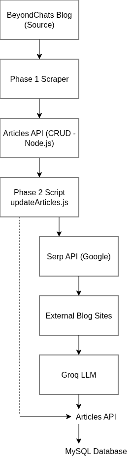

## BeyondChats Assignment

This repository contains my submission for the Full Stack Developer Intern assignment at BeyondChats.
The goal of this project is to scrape blog articles, store them, update them using LLMs, and display
both original and updated versions through a simple frontend.

The work is divided into three phases as mentioned in the assignment.

---

## Live Demo

Frontend: https://llm-rewrite-article.vercel.app/

The live frontend displays original and LLM-updated articles side by side
for direct comparison.

---

### Tech Stack

- Node.js
- Express.js
- MySQL
- React

---

### Project Structure

The backend handles scraping, database operations, and automation logic.
The frontend is a small React app used to display articles.

---

## Phase Breakdown

### Phase 1: Scraping & CRUD

- Scrapes the **5 oldest articles** from the BeyondChats blogs section.
- Stores article data in a MySQL database.
- Exposes CRUD APIs to manage articles.

The scraper first identifies the **last page** of the blogs section and starts collecting articles
from there. If the last page contains fewer than 5 articles, it fetches one additional previous page
and combines results to complete the required count.

When combining multiple pages, articles from previous pages are read **bottom-up** to preserve
chronological order and ensure the oldest articles are selected.

---

### Phase 2: Article Updating Pipeline (Design)

Phase 2 is implemented as a Node.js script that runs as a background/batch job.
It is intentionally not exposed as an API endpoint, since the task is automation-oriented
and easier to debug as a standalone script.

The goal of this phase is to update existing articles by learning from similar
articles that rank higher on search engines.

---

### Phase 3: Frontend

A simple React-based frontend fetches articles from the backend APIs and displays
both original and updated versions. The UI focuses on readability and responsiveness
without unnecessary complexity.

---

#### High-level Flow

1. Fetch original articles from the internal Articles API.
2. For each article, search Google using the article title.
3. From the search results, pick the first two links that point to blog/article pages
   published by other websites.
4. Scrape the main content from these two external articles.
5. Send the original article and the reference articles to an LLM with a controlled prompt.
6. Store the newly generated article using the existing CRUD APIs.
7. Save reference links separately and display them at the bottom of the updated article.

---

#### Google Search Strategy

Instead of scraping Google HTML directly (which is brittle and prone to blocking),
a search API is used to fetch search results in a stable and predictable way.

This keeps the focus of the assignment on content processing and automation logic,
rather than dealing with anti-bot protections.

Only results that look like blog or article pages are considered.

Basic heuristics are applied to filter blog/article-style links from search results.

External article content is lightly truncated to keep LLM input manageable.

---

#### LLM Usage

The LLM is used as a controlled rewriting step, not as a content generator from scratch.

The prompt is designed to:

- Preserve the original intent of the article.
- Improve clarity, structure, and depth.
- Align tone and formatting with the reference articles.
- Avoid copying or closely paraphrasing reference content.

The LLM is instructed to return clean, structured markdown without inline citations.
Reference links are added separately at the end of the article.

The LLM is treated as a rewriting tool with strict constraints, not as a free-form content generator.

---

### LLM Provider Choice (Phase 2)

Phase 2 requires calling an LLM API to rewrite existing articles based on reference content.
The pipeline was intentionally designed to be provider-agnostic, with all LLM logic isolated
inside a single service layer.

#### Initial Approach

The initial implementation used OpenAI-compatible APIs. However, during local development,
the OpenAI free tier account had `$0` available credits, which resulted in consistent
`insufficient_quota` errors. Even though the integration and retry logic were correct,
requests were rejected before execution.

A similar issue was encountered while testing Google Gemini, where valid API keys were loaded
successfully but requests failed due to account-level API restrictions.

These issues were related to **API access and billing**, not code correctness.

---

#### Final Decision: Groq

To ensure the Phase 2 pipeline could run end-to-end during local testing, the LLM provider
was switched to **Groq**, which offers a free and reliable API for OpenAI-compatible models
(e.g. LLaMA 3.3).

Reasons for choosing Groq:

- Free-tier availability without billing setup
- OpenAI-compatible API format (minimal code changes)
- Fast and stable responses for long-form text rewriting

The original `llm.service.js` was replaced with `groq.service.js`, while keeping the same
function signature. This allowed the rest of the pipeline to remain unchanged.

---

#### Current Behavior

- The Phase 2 script successfully:
  - Fetches original articles
  - Searches and scrapes reference articles
  - Calls the Groq LLM to rewrite content
  - Stores updated articles along with reference links
- All external API calls include defensive checks and graceful failure handling
- If any step fails for a specific article, the pipeline skips it and continues

This approach ensures correctness, transparency, and a working end-to-end flow without
relying on paid API credits.

---

#### Data Storage Approach

Updated articles are stored using the same `articles` table:

- Original articles have `is_updated = 0`
- Updated articles have `is_updated = 1`
- Reference links are stored as JSON and rendered separately on the frontend

This avoids unnecessary schema complexity while keeping the relationship clear.

---

#### Error Handling & Trade-offs

- If fewer than two suitable reference articles are found, the article is skipped.
- Failures in one article do not stop the entire script.
- The pipeline prioritizes clarity and determinism over aggressive automation.

The goal of this phase is correctness and explainability, not maximum throughput.

---

### Data Flow Diagram

The backend diagram below shows the high-level data flow across all three phases.
It highlights how articles are scraped, stored, updated using an LLM,
and finally displayed on the frontend.

The focus of the diagram is clarity of data movement rather than
low-level implementation details.

The frontend acts as a presentation layer that fetches article data from the backend API.
Upon page load, the React application sends a GET request to /api/articles.
The backend responds with both original and updated articles.

The frontend groups articles by title and displays the original and rewritten versions side by side, along with reference links.
No data mutation occurs on the frontend.

## 

### Phase 3: Frontend

- React-based frontend to display articles.
- Shows both original and updated versions.
- Simple, responsive UI focused on readability rather than heavy styling.

---

### Database Setup

1. Install MySQL locally.
2. Create a database (for example: `beyondchats`).
3. Run the schema file:

   mysql -u root -p beyondchats < backend/db/schema.sql

Database credentials are managed using environment variables.

---

### Design Notes & Decisions

The scraper intentionally uses simple and defensive selectors to avoid overfitting to the
current HTML structure of the blog.

Pagination is handled explicitly to ensure the scraper always targets the oldest content, even
when the last page contains fewer articles.

I checked for an RSS/Atom feed as a cleaner way to fetch articles, but chose to scrape the blogs
section directly to stay aligned with the assignment requirement of scraping from the last page.

Backend code follows a basic service–controller pattern to keep responsibilities separated and the
logic easy to follow.

Original articles are stored immutably. Updated articles are inserted
as separate records, enabling clean side-by-side comparison without
mutating source data.

---

### Notes

The focus of this project is correctness, clarity, and following the assignment requirements without
over-engineering.
