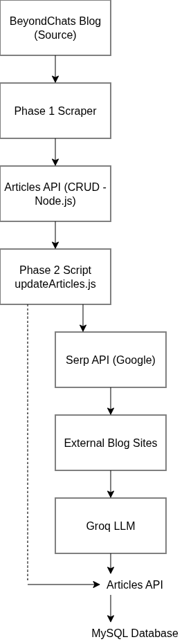
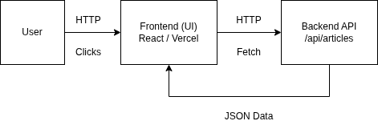

## AI-Assisted Article Rewriting Pipeline

This project is an end-to-end content automation system that scrapes existing blog articles, analyzes higher-ranking reference content, and generates improved versions using LLMs.

It combines web scraping, search APIs, and controlled AI rewriting into a single pipeline designed to enhance article quality while preserving original intent.

---

## Live Demo

Frontend: https://llm-rewrite-article.vercel.app/
Backend: https://llm-rewrite-article.onrender.com/api/articles

The frontend displays original and rewritten articles side by side for direct comparison, along with reference sources.

---

### Tech Stack

- Backend: Node.js, Express.js

- Frontend: React

- Database: MySQL

- LLM Integration: Groq (LLaMA-based models)

- Other: REST APIs, Web Scraping

---

### Key Features

- Automated Article Scraping
  Extracts older blog articles and stores them in a structured database.

- End-to-End Rewrite Pipeline
  Processes articles through search, scraping, and AI rewriting automatically.

- Reference-Based Content Improvement
  Uses higher-ranking external articles to improve structure, clarity, and depth.

- Controlled LLM Usage
  Ensures rewritten content preserves intent and avoids copying or hallucination.

- Side-by-Side Comparison UI
  Displays original and rewritten articles with reference links for transparency.### Project Structure

- The backend handles scraping, database operations, and automation logic.
  The frontend is a small React app used to display articles.

---

### System Architecture

The system is divided into three main layers:

- Data Collection Layer
  Scrapes articles and stores them in the database.

- Processing Pipeline
  Enriches articles with external references and rewrites them using an LLM.

- Presentation Layer
  Displays original and updated content via a React frontend.

---

### Pipeline Flow

1. Input
   Fetch original articles from the database.

2. Search & Enrichment
   Use a search API to find relevant high-ranking articles based on the title.

3. Content Extraction
   Scrape and clean content from selected reference articles.

4. LLM Transformation
   Pass original + reference content into an LLM with a structured prompt.

5. Output Storage
   Store rewritten articles along with reference links.

6. Frontend Rendering
   Display both versions side by side for comparison.

---

### LLM Design Approach

The LLM is used as a controlled transformation layer, not a free-form generator.

The prompt is designed to:

- Preserve the original meaning of the article

- Improve clarity, structure, and readability

- Incorporate insights from reference articles

- Avoid copying or closely paraphrasing external content

The output is clean, structured markdown. Reference links are added separately to maintain transparency.

---

### LLM Provider Decision

The pipeline was designed to be provider-agnostic, with LLM logic isolated in a service layer.

During development:

- OpenAI APIs failed due to quota limits

- Gemini APIs failed due to account restrictions

To ensure a working pipeline, the system was switched to Groq, which provided:

- Free-tier access without billing setup

- OpenAI-compatible API format

- Fast and stable responses for long-form rewriting

This allowed the pipeline to run end-to-end without changing core logic.

---

### Data Storage Strategy

All articles are stored in a single table:

- is_updated = 0 → Original articles

- is_updated = 1 → Rewritten articles

Reference links are stored as JSON and rendered separately in the frontend.

This keeps the schema simple while maintaining a clear relationship between versions.

---

### Error Handling & Trade-offs

- Articles are skipped if sufficient reference content is not available

- Failures in one step do not break the entire pipeline

- External content is truncated to stay within LLM limits

The system prioritizes reliability and clarity over aggressive automation.

---

### Why This Project

This project explores how AI can be used to augment content workflows, not replace them.

Potential applications include:

- Improving SEO performance of existing content

- Scaling content rewriting for blogs or media platforms

- Assisting writers with structured, reference-backed drafts

It demonstrates how LLMs can be integrated into real systems with control, constraints, and transparency.

---

### Future Improvements

- Ranking reference articles using semantic similarity

- Adding evaluation metrics for content quality

- Introducing human-in-the-loop editing workflows

- Scheduling pipeline execution (cron jobs / queues)

- Improving prompt strategies for domain-specific writing

---

### Data Flow Diagram

The backend diagram below shows the high-level data flow across all three phases.
It highlights how articles are scraped, stored, updated using an LLM,
and finally displayed on the frontend.

The focus of the diagram is clarity of data movement rather than
low-level implementation details.

The frontend acts as a presentation layer that fetches article data from the backend API.
Upon page load, the React application sends a GET request to /api/articles.
The backend responds with both original and updated articles.

The frontend groups articles by title and displays the original and rewritten versions side by side, along with reference links.
No data mutation occurs on the frontend.

---

### Local Setup

1. Clone the repository

2. Install dependencies

3. npm install

4. Configure .env variables

5. Run scraper

6. Start backend server

7. Run rewrite pipeline

8. Start frontend
